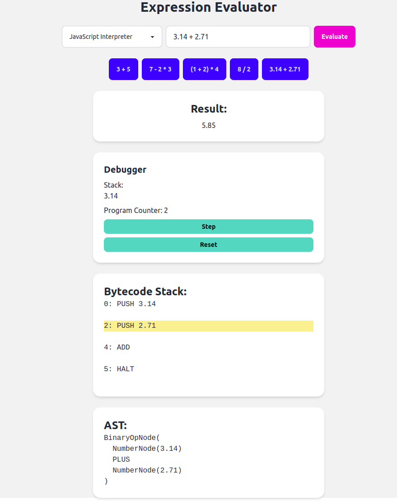

# calculator-parser

To install dependencies:

```bash
bun install
```

To run with Bun:

```bash
bun run main.js
```

To run with Vite:

```bash
bun run dev
```

```bash
bun run main.js
```

This project was created using `bun init` in bun v1.1.27. [Bun](https://bun.sh) is a fast all-in-one JavaScript runtime.
# Project Name

This project is a demonstration of using AI-assisted coding to rapidly develop and test new approaches in software development. The project was created in a couple of hours using Aider, an AI tool designed to assist developers in writing and refactoring code efficiently.

## Overview

The project includes several components that work together to interpret and execute bytecode. It features a lexer, parser, and interpreters for both JavaScript and WebAssembly environments. The goal is to provide a flexible and efficient way to evaluate expressions and execute bytecode.

## Features

- **Lexer and Parser**: Convert source code into tokens and parse them into an abstract syntax tree (AST).
- **Bytecode Interpreter**: Execute bytecode instructions using different interpreters.
- **WebAssembly Support**: Leverage WebAssembly for executing bytecode in a performant manner.
- **AI-Assisted Development**: Utilized Aider to streamline the development process and implement features quickly.

## Getting Started

To get started with this project, clone the repository and install the necessary dependencies:

```bash
git clone <repository-url>
cd <repository-directory>
npm install
```

## Usage

Run the project using the following command:

```bash
npm start
```

## Contributing

Contributions are welcome! Please feel free to submit a pull request or open an issue if you have any suggestions or improvements.

## License

This project is licensed under the MIT License.

## Screenshot



## Acknowledgments

Special thanks to Aider for providing the AI tools that made this rapid development possible.
